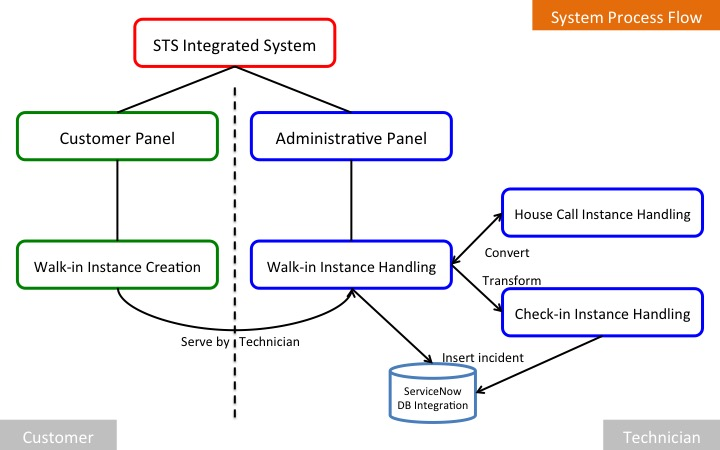
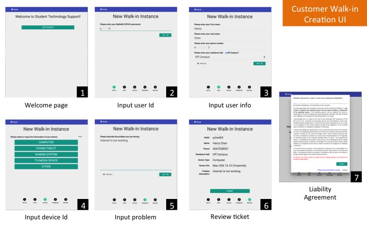
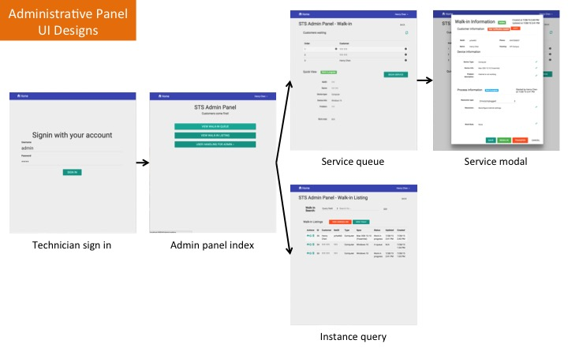

## System Components

#### System structure

Figure 1. Illustration of system process flow

The system has two main panels, cutomer and administrative, and it has a total of four sub-components, walk-in instance creation, walk-in instance processing, check-in instance processing, and ServiceNow database integration. Once a customer has created a walk-in instance, he or she will be served by one of our STS technicians. The technician can determine to resolve the instnace, covert it to a house call, or transform it into a check-in instance based on the technical problem the customer is experiencing. After either a walk-in (house call included) or a check-in instance is resolved, the system will automatically send a SOAP request to the ServiceNow system to insert the instance and save the incident permanently in the ServiceNow database.

#### Customer panel (Walk-in instance creation)

Figure 2. Cutomer walk-in creation UI

#### Administrative panel

Figure 3. Administrtive panel UI